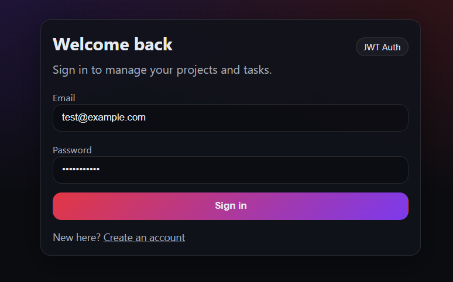
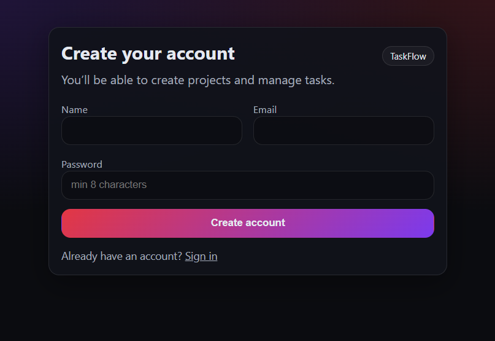
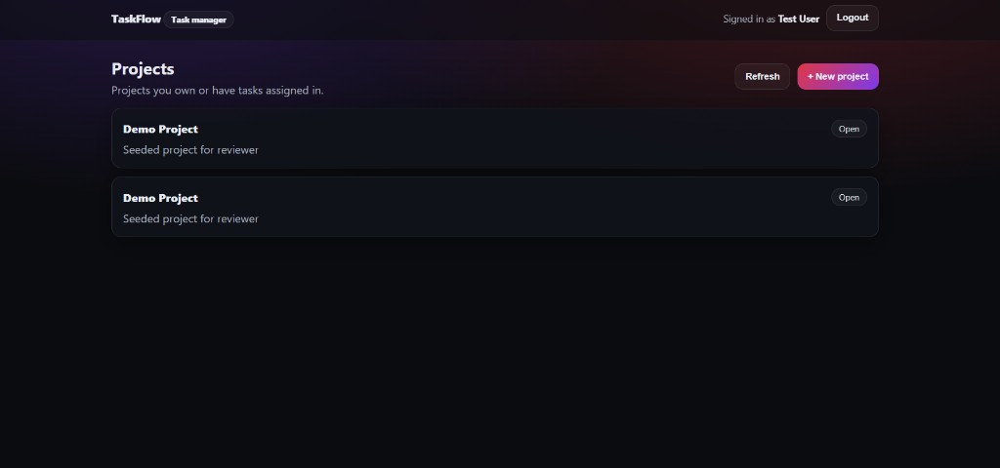
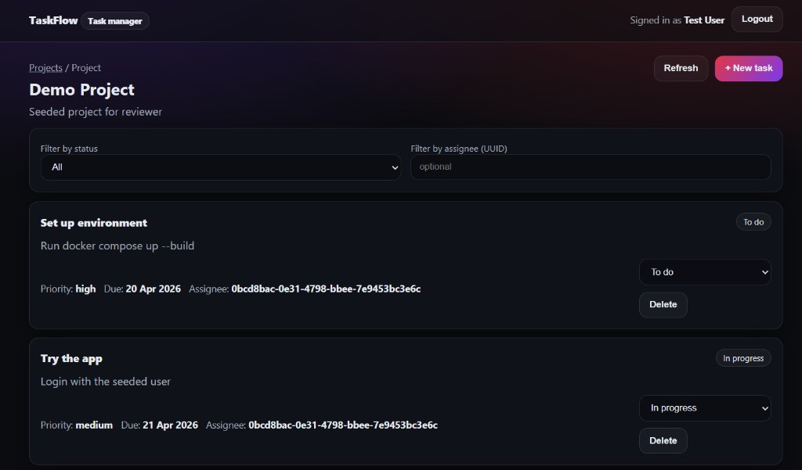
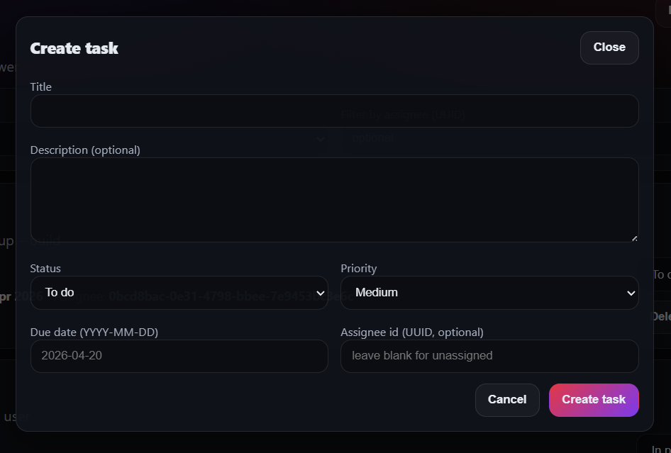

# TaskFlow — Full Stack Task Management System
**Zomato · Greening India Tech Assignment**

A production-style task management system with **JWT authentication**, **projects**, and **tasks**, shipped as a **Dockerized full stack** with database migrations + seed data.

## 🚀 Live Overview

TaskFlow enables users to:

- 🔐 Securely register and authenticate using JWT (24h expiry)
- 📁 Create and manage projects
- 📋 Create, update, and delete tasks
- 👥 Assign tasks to users
- 🔎 Filter tasks by status and assignee
- ⚡ Experience optimistic UI updates for fast status changes

## 🎬 Demo (Screenshots)

| Login | Register |
|---|---|
|  |  |

| Projects | Project detail |
|---|---|
|  |  |

| Create task modal |
|---|
|  |

## 🏗️ Tech Stack

### Backend
- Node.js (Express + TypeScript)
- PostgreSQL
- `node-pg-migrate` (schema migrations, up/down)
- JWT Authentication
- `bcrypt` hashing (bcryptjs, cost ≥ 12)

### Frontend
- React + TypeScript (Vite)
- React Router (protected routes, redirects to `/login`)
- Modern responsive UI (mobile 375px → desktop 1280px)

### Infrastructure
- Docker + Docker Compose (Postgres + API + Web)
- Multi-stage API + Web Dockerfiles
- One-command startup for reviewers

## 🧠 System Architecture

```mermaid
flowchart TD
  UI[React Client] -->|HTTP JSON| API[Express API]
  API --> AUTH[Auth Middleware (JWT)]
  API --> DB[(PostgreSQL)]
  API --> MIG[Migrations + Seed on start]
```

### Key Design Decisions
- **TypeScript-first**: safer refactors, fewer runtime surprises
- **Clear HTTP semantics**: 400 validation / 401 unauthenticated / 403 forbidden / 404 not found
- **JWT-based auth**: stateless and scalable
- **Migration-driven schema**: versioned DB changes (no ORM magic)
- **Centralized API client (frontend)**: consistent auth header + error handling

### Trade-offs
- No real-time updates (SSE/WebSockets) to keep scope focused
- Minimal RBAC beyond project owner + task creator rules
- Limited test coverage (bonus items can be added)

## 🐳 Running the Project (One Command)

```bash
git clone <your-repo-url>
cd <repo-folder>
cp .env.example .env
docker compose up --build
```

### 🌐 Application URLs
- Frontend: `http://localhost:3000`
- Backend API: `http://localhost:8000`
- Health check: `http://localhost:8000/health`

## 🔑 Test Credentials (seeded)

```
Email:    test@example.com
Password: password123
```

## 🔄 Database Migrations

Migrations run **automatically** when the backend container starts.

Manual run (inside the backend container):

```bash
docker compose exec backend npm run migrate
```

## 📡 API Endpoints

All endpoints return `Content-Type: application/json`.  
All non-auth endpoints require `Authorization: Bearer <token>`.

### Auth
- `POST /auth/register`
- `POST /auth/login`

### Projects
- `GET /projects`
- `POST /projects`
- `GET /projects/:id`
- `PATCH /projects/:id`
- `DELETE /projects/:id`

### Tasks
- `GET /projects/:id/tasks?status=&assignee=`
- `POST /projects/:id/tasks`
- `PATCH /tasks/:id`
- `DELETE /tasks/:id`

## ⚠️ Error Handling

Validation errors:

```json
{ "error": "validation failed", "fields": { "email": "is required" } }
```

Auth/permission errors:

```json
{ "error": "unauthorized" }
```

```json
{ "error": "forbidden" }
```

Not found:

```json
{ "error": "not found" }
```

## 🧪 Quick API Smoke Test (curl)

```bash
# login (seed user)
TOKEN=$(curl -s http://localhost:8000/auth/login \
  -H "Content-Type: application/json" \
  -d '{"email":"test@example.com","password":"password123"}' | node -p "JSON.parse(fs.readFileSync(0,'utf8')).token")

# list projects
curl -s http://localhost:8000/projects -H "Authorization: Bearer $TOKEN"
```

## 📈 Future Improvements

Given more time, I would:
- Add pagination (`page/limit`) for list endpoints
- Add project analytics (`GET /projects/:id/stats`)
- Add integration tests for auth + task update flows
- Add a Kanban board (drag & drop) + dark mode toggle
- Improve auditability (activity log, richer history)

## 🏆 Key Highlights
- Fully Dockerized full-stack app (`docker compose up --build`)
- Clean, reviewable code structure and API semantics
- Production-like auth (bcrypt + JWT)
- Seeded reviewer account + demo data for instant evaluation

